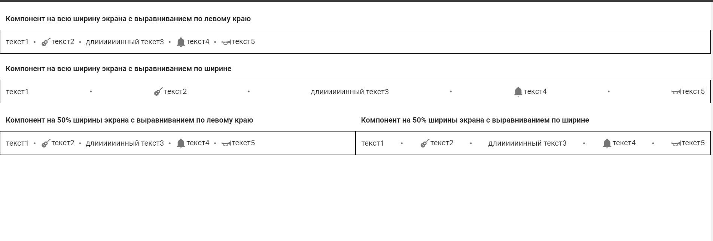

# tags-component-vue2-vuetify

## demo: https://nklj.github.io/tags-component-vue2-vuetify/

[](https://nklj.github.io/tags-component-vue2-vuetify/)


## тестовое задание vue2

## Описание проекта

Реализация компонента "текстовые теги". Сделана в качестве тестового задания.\

## Stack:
- Vue 2
- Vuetify 2
- SCSS

## Project setup
```
npm install
```

### Compiles and hot-reloads for development
```
npm run serve
```


